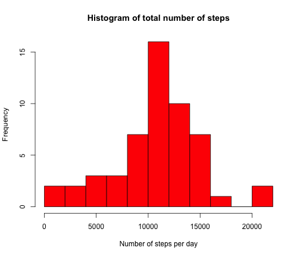
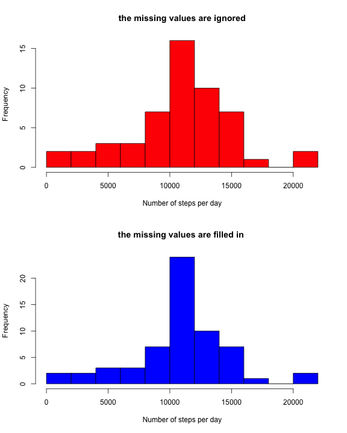

Activity Monitoring Statistics
========================================================

## Introduction 

 At the current report, data from a personal activity monitoring device will be analysed. This device collects data at 5 minute intervals through out the day. The data consists of two months of data from an anonymous individual collected during the months of October and November, 2012 and include the number of steps taken in 5 minute intervals each day.
 
## Data


```r
setwd("~/Documents/Olesya/RepData_PeerAssessment1")
dataset<-read.csv("activity.csv", colClasses = c("numeric", "Date", "numeric"))
```
The variables included in this dataset are:

+ **steps**: Number of steps taking in a 5-minute interval (missing values are coded as NA)

+ **date**: The date on which the measurement was taken in YYYY-MM-DD format

+ **interval**: Identifier for the 5-minute interval in which measurement was taken

There are a total of 17,568 observations in this dataset.

## Processing the Data

** Mean total number of steps taken per day**

First, the missing values are removed from dataset, in order to avoid bias in the calculations.Then,it is calcutated **mean total number of steps taken per day** 


```r
 good<-complete.cases(dataset)
 data<-dataset[good,]

 sum_steps <- sapply(split(data$steps,data$date),sum)
```
Histogram of the total number of steps taken each day:

```r
hist(sum_steps, breaks= 10, col="red", main="Histogram of total number of steps", 
                        xlab = "Number of steps per day")
```

 

Let's calculate **Mean** and **Median** total number of steps taken per day

```r
 summary(sum_steps)
```

```
##    Min. 1st Qu.  Median    Mean 3rd Qu.    Max. 
##      41    8840   10800   10800   13300   21200
```
+ Mean total number of steps taken per day is 10 800 steps

+ Median total number of steps taken per day is  10 800 steps
  
  ** The average daily activity pattern**
  
  Let's find the average number of steps taken in each 5-minute interval and make a time series plot.
  
  
  ```r
  y <-sapply(split(dataset$steps,dataset$interval),mean,na.rm = TRUE)
  x <- unique(dataset$interval)
  plot(x,y,type="l",ylab = "Average number of steps", 
                                          xlab="Interval")                                 
  ```
  
   
 
 
 ```r
  y[y==max(y)]    
 ```
 
 ```
 ##   835 
 ## 206.2
 ```

5-minute interval, on average across all the days in the dataset, which contains the maximum number of steps is 835 with max steps 206.

  **Imputing missing values**
  
  The presence of missing days may introduce bias into some calculations or summaries of the data. Let's calculate the total number of missing values in the dataset.
  
  
  ```r
  nobs <- sum(!good)
  nobs
  ```
  
  ```
  ## [1] 2304
  ```
In order to check how the missing values influence on calculation, a new dataset is created that is equal to the original dataset but with the missing data filled in. The mean for that 5-minute interval is used for filling in missing values.


```r
dataset_new <- dataset 
#Remove names attributes
names(y) <- NULL
 #Column binding of intervals and average steps
donor <-cbind(x,y)
#Give some attributes to y2
donor <- data.frame(interval=donor[,1],steps=donor[,2])
#Merge data
r = merge(dataset_new,donor,by="interval")
#Here we need to sort it by date
r<-r[order(r$date),]
#Get bad indices with NA
bad = which(is.na(dataset_new$steps))
#Full result is
dataset_new[bad,"steps"]=r[bad,"steps.y"]
head(dataset_new)  
```

```
##     steps       date interval
## 1 1.71698 2012-10-01        0
## 2 0.33962 2012-10-01        5
## 3 0.13208 2012-10-01       10
## 4 0.15094 2012-10-01       15
## 5 0.07547 2012-10-01       20
## 6 2.09434 2012-10-01       25
```

Histogram of the total number of steps taken each day for new dataset:

```r
par(mfrow=c(2,1))
##plot1
hist(sum_steps, breaks= 15, col="red", main="the missing values are ignored", 
                        xlab = "Number of steps per day")
##plot2

sum_steps_new <- sapply(split(dataset_new$steps,dataset_new$date),sum)
hist(sum_steps_new, breaks= 15, col="blue", main="the missing values are filled in ", 
                        xlab = "Number of steps per day")
```

 

Let's calculate **Mean** and **Median** total number of steps taken per day

```r
 summary(sum_steps_new)
```

```
##    Min. 1st Qu.  Median    Mean 3rd Qu.    Max. 
##      41    9820   10800   10800   12800   21200
```
+ Mean total number of steps taken per day is 10 800 steps

+ Median total number of steps taken per day is  10 800 steps
  
  
  
Obviously, we can say that missing values have impact on distribution but mean and median number are the same. When missing values are not taken into account, the histogram is more flatter, than the histogram for the case, when missing values are filled in.


 **Differences in activity patterns between weekdays and weekends**
 
  Let's consider the average number of steps taken, averaged across all weekday days or weekend days.
  

```r
  week <- weekdays(dataset_new$date, abbreviate = FALSE)
  dataset_week <- cbind(dataset_new, week)
  dataset_week$week <- ifelse(as.POSIXlt(as.Date(dataset_week$date))$wday%%6 == 
                                           0, "weekend", "weekday")
  dataset_week$week <- factor(dataset_week$week,levels=c("weekend","weekday"))
  head(dataset_week)
```

```
##     steps       date interval    week
## 1 1.71698 2012-10-01        0 weekday
## 2 0.33962 2012-10-01        5 weekday
## 3 0.13208 2012-10-01       10 weekday
## 4 0.15094 2012-10-01       15 weekday
## 5 0.07547 2012-10-01       20 weekday
## 6 2.09434 2012-10-01       25 weekday
```

```r
  library("data.table")
  dataset_week <- data.table(dataset_week)
  res <- dataset_week[, mean(steps), by="interval,week"] 
  weekday <- res[1:288,]
  weekend <- res[289:576,] 
```

```r
  par(mfrow=c(2,1))

  plot(weekday$interval,weekday$V1,type="l",ylab = "Average number of steps", 
      xlab="Interval", main="weekday")  
  plot(weekend$interval,weekend$V1,type="l",ylab = "Average number of steps", 
      xlab="Interval", main="weekend")  
```

 
                                          
Plot containing a time series plots of the 5-minute interval (x-axis) and the average number of steps taken, averaged across all weekday days or weekend days (y-axis)
